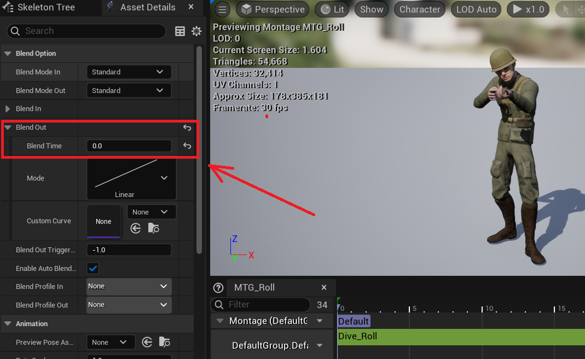
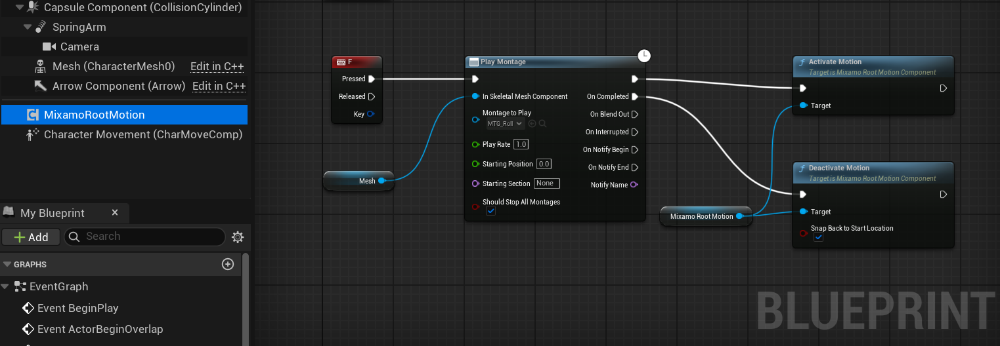

# Mixamo-Root-Motion-Fix
This is an UnrealEngine ActorComponent which implements custom root motion behaviour for Mixamo root-less skeletons.  

[Mixamo Converter](https://github.com/enziop/mixamo_converter) tool does not work well for projects with many existing animations, as converting all of them is painful (also in my case, it didn’t even work correctly in a fresh project using Blender 4.4).  
This component requires more setup but allows to leave all animations untouched.

## Limitations
1. Does not support vertical movement. Native Unreal root motion works together with the CharacterMovementComponent to handle this. For a custom script, additional work would be required, such as detecting Z-axis animations, disabling gravity, changing the MovementMode, and so on.
2. No blend-out. The purpose of this component is to move the entire capsule forward while shifting only the mesh (skeleton) backward, preventing double speed. Because the skeleton is not at its origin during animation, blending out would cause unwanted movement such as sliding or teleportation.
# Setup
## Montage
Remove blend-out.  

  

## Blueprint
Activate/Deactivate custom root motion logic for the montage as shown below (C++ way is very similar with delegates).  
`SnapBackToStartLocation` flag should stay true for most cases, but false is useful for death scenario or interruptions. 

  

# Result
  
